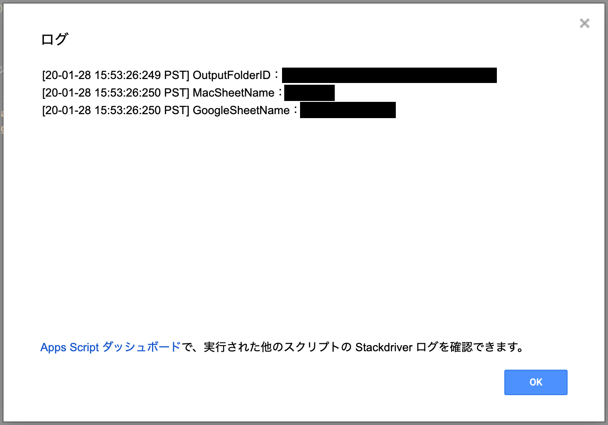

# dictionary-file

辞書ファイルをGoogleスプレッドシートのデータから作成しダウンロードできるツールです  
plistファイル、txtファイルをGoogleドライブの特定フォルダに作成しそのファイルをダウンロードするリンクを生成する

## 設定

### プロジェクトのプロパティ

プロジェクトのプロパティからスクリプトのプロパティを設定します  
`OUTPUT_FOLDER_ID`, `MAC_SHEET_NAME`, `GOOGLE_SHEET_NAME` の３つのプロパティを設定する

| プロパティ名       | 設定する値について                                                              |
|:------------------:|:--------------------------------------------------------------------------------|
|  OUTPUT_FOLDER_ID  | 作成される辞書ファイルの出力先フォルダ(Googleドライブに予め作成して下さい)のID  |
|  MAC_SHEET_NAME    | MAC標準の辞書ファイル(plist)を作成するためのデータが書かれているシート名        |
|  GOOGLE_SHEET_NAME | Google日本語入力の辞書ファイル(txt)を作成するためのデータが書かれているシート名 |

正しく設定されているかはスクリプトエディタから `TestConfig` を選択し実行します

ログを確認して正しい値が表示されていることを確認してください

### 辞書ファイル用のデータを設定する

#### Mac標準の辞書ファイル用

シートに `入力`と `変換`の値を登録してください

入力例

| 入力    | 変換                               |
|:-------:|:-----------------------------------|
|  hoge   | ホゲホゲ                           |
|  住所   | 宇宙太陽系地球アジア日本東京都…… |
|  怪獣   | ゴジラ                             |

#### Google日本語入力の辞書ファイル用

シートに `入力` と `変換` と `品詞` と `コメント` の値を登録してください  
`品詞` と `コメント` はおそらく無くても大丈夫です

入力例

| 入力    | 変換                               | 品詞  | コメント                   |
|:-------:|:-----------------------------------|:------|:---------------------------|
|  hoge   | ホゲホゲ                           | 名詞  | うん                       |
|  住所   | 宇宙太陽系地球アジア日本東京都…… | 名詞  | 住所しゅごい               |
|  怪獣   | ゴジラ                             | 名詞  | 怪獣と言ったらゴジラだよね |

## 使い方

`追加機能` メニューが追加されているのでクリックしてください

ダイアログが表示されたらダウンロードリンクをクリックするだけです

